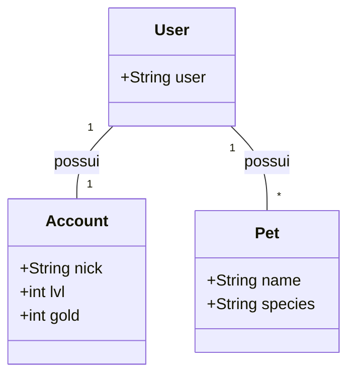

# projeto-dio

##Diagrama de Classes

```mermaid
classDiagram
    User "1" -- "1" Account: possui
    User "1" -- "*" Pet: possui
    class User {
        +String user
    }
    class Account {
        +String nick
        +int lvl
        +int gold
    }
    class Pet {
        +String name
        +String species
    }
```
